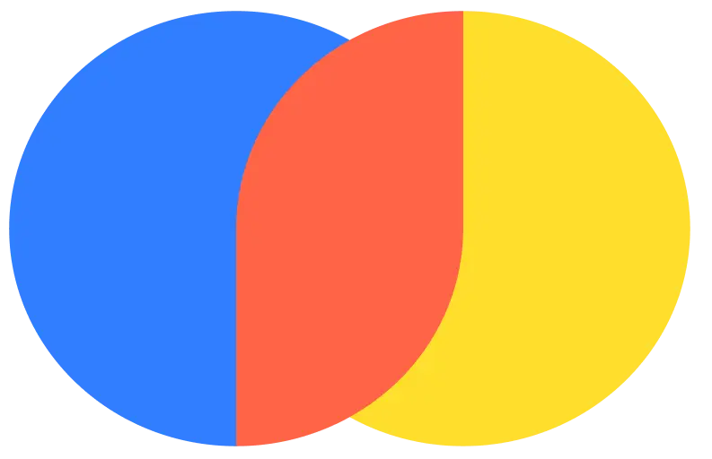

<h1 align="center">Hi 👋, I'm Karan</h1>
<h3 align="center">A passionate Computer science student from India</h3>

Hi, I'm Karanraj Kumbala, a Computer Science student at SR University. I have a passion for uncovering patterns and transforming data into insights, with a strong foundation in statistical analysis, machine learning, and data visualization.

I enjoy leveraging advanced analytics to solve complex problems and am eager to explore new data science methodologies and technologies. My projects range from predictive modeling and data wrangling to insightful visualizations.

Welcome to my GitHub profile, where you can see my work in machine learning algorithms and data-driven web applications. I'm excited to collaborate and grow in this dynamic field! 
 

- 🔭 I’m currently working on **Backend** ;               - 🌱 I’m currently learning **Web Development**

- 👯 I’m looking to collaborate with **passionate people**   ;   - 📫 How to reach me **karanraj3056@gmail.com**

  

<h3 align="left">Connect with me:</h3>

<h2><strong>Languages and Tools:</strong></h2> 

<h3 align="left">Languages:</h3>
<table>
  <tr>
    <th>Python3</th>
    <th>C</th>
    <th>C++</th>
    <th>Java</th>
    <th>JavaScript</th>
    <th>TypeScript</th>
    
  </tr>
  <tr>
    <td>
     
    </td>
      <td>
        
    </td>
     <td>
     
    </td>
     <td>
        
    </td>
     <td>
      
    </td>
     <td>
      
     </td>
       
  </tr>
</table>

 <h3 align="left">Data Science and AI/ML:</h3> 
 <table>
  <tr>
    <th>Numpy</th>
    <th>Pandas</th>
    <th>Matplotlib</th>
    <th>Seaborn</th>
    <th>Sklearn</th>
    <th>Keras</th>
    <th>Pytorch</th>
    <th>Flask</th>
    <th>Langchain</th>
    <th>HuggingFace</th>
    <th>CrewAi</th>
  
  </tr>
  <tr>
    <td>
     
    </td>
     <td>
      
    </td>
     <td>
      <a href="https://www.mathworks.com/" target="_blank" rel="noreferrer">  
    </td>
        <td>
      
     </td>
     <td>
     
    </td>
    <td>
      
    </td>
    <td>
      
    </td> 
    <td>
      
    </td>
    <td>
      
    <td>
      
    </td>
    <td>
      
    </td> 
  </tr>
</table>

 <h3 align="left">Web Development:</h3>
 <table>
  <tr>
    <th>HTML5</th>
    <th>CSS3</th>
    <th>ReactJS</th>
    <th>NodeJS</th>
    <th>ExpressJS</th>
    <th>Bootstrap</th>
  </tr>
  <tr>
    <td>
     
    </td>
    <td>
     
     </td>
    <td>
     
    </td>
     <td>
      
    </td>
     <td>
      
    </td>
     <td>
      
    </td>
  </tr>

</table>

 <h3 align="left">Data Management:</h3> 
 <table>
  <tr>
    <th>MySQL </th>
    <th>MongoDB</th>   
    <th>PostgreSQL</th>
    <th>ChromaDB (vector database)</th>

  </tr>
     <td>
        
    </td>
     <td>
     
    </td>
      <td>
        
    </td>
      <td>
        
      </td>
  </tr>
  </table>
<h3 align="left">Environments,OS,Testing & Other:</h3> 
<table>
  <tr>
    <th>VScode</th>
    <th>GIT</th>
    <th>GitHUB</th>   
    <th>Jupyter</th>  
    <th>Anaconda </th>  
    <th>Docker</th>
    <th>Postman</th>
    <th>AWS</th>
  </tr>
<tr>
   <td>
     
    </td>
   <td>
     
    </td>
   <td>
     
    </td>
   <td>
     
    </td>
   <td>
     
    </td>
    <td>
      
    </td>
   <td>
     
    </td>
   <td>
     
    </td> 
</tr>
</table>

       
  

  

  
  

 

  

 

